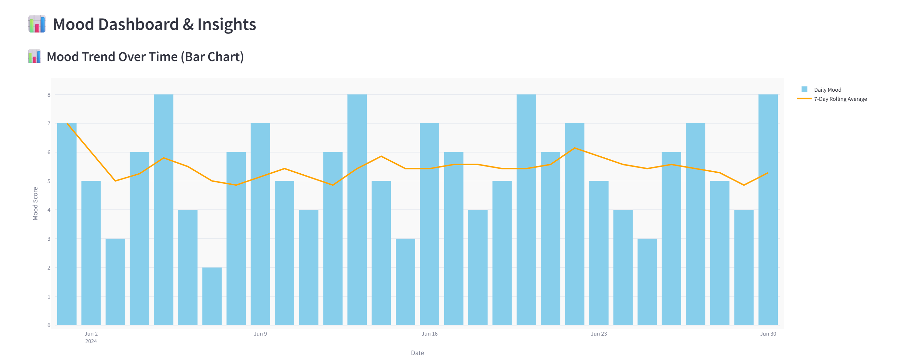

# Mental Health Mood Tracker with Insights

A web application to track moods, analyze emotional patterns, and receive mental health insights and suggestions.

## Features
- Daily mood tracking (select mood, score, emoji, tags, journal)
- Sentiment analysis of journal entries
- Mood trend visualization (bar chart with rolling average)
- Pattern detection (low mood days, recurring patterns)
- Personalized recommendations
- Insights dashboard

## Tech Stack
- Frontend: Streamlit
- Backend: FastAPI (Python)
- Database: MongoDB
- ML/AI: NLP, time series, anomaly detection

## Architecture Pipeline
```
Mood entries → Trend analysis → Pattern recognition → Actionable insights
```
- **Data Collection:** User logs mood, tags, journal (frontend → backend)
- **Trend Analysis:** Rolling means, trends (backend)
- **Pattern Recognition:** Low mood days, recurring patterns (backend)
- **Actionable Insights:** Recommendations, alerts (backend → frontend)

## Setup
1. Clone the repo
2. Install dependencies: `pip install -r requirements.txt`
3. Set up MongoDB (local or Atlas)
4. Run backend: `uvicorn backend.app:app --reload`
5. Run frontend: `streamlit run frontend/streamlit_app.py`

## Folder Structure
```
mood-tracker/
├── backend/
│   ├── app.py
│   ├── data_collection.py
│   ├── trend_analysis.py
│   ├── sentiment_analysis.py
│   ├── pattern_detection.py
│   ├── recommendation.py
│   └── models/
├── frontend/
│   └── streamlit_app.py
├── data/
│   └── sample_mood_entries.json
├── README.md
└── requirements.txt
```

## Sample Data
- `data/sample_mood_entries.json` contains 30 sample entries in the new format:
  - `mood`: e.g., "Happy", "Sad"
  - `mood_score`: 1–10
  - `emoji`: e.g., "😊"
  - `tags`: list of tags, e.g., `["productive", "happy"]`
  - `journal_text`: free text
  - `timestamp`: ISO string

**To use for testing:**
- You can import this JSON into MongoDB or use it to seed your database for demo/testing.

## Usage
- Select your mood, score, tags, and write a journal entry.
- View mood trends, low mood days, and get personalized recommendations.

## Result Output

### Log Today's Mood


### Mood Trend Chart


### Word Cloud


### Weekly Summary


### Personalized Recommendations


Each section is designed to give you insights into your emotional well-being and help you track your mental health over time.

---
For questions or contributions, open an issue or pull request! 